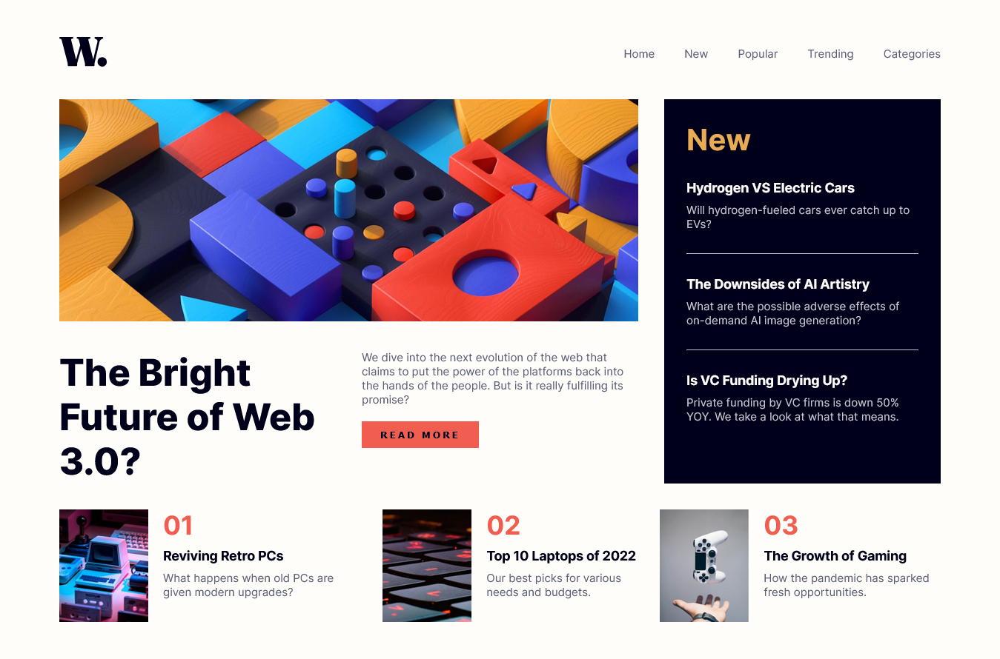

# Frontend Mentor - News homepage solution

This is a solution to the [News homepage challenge on Frontend Mentor](https://www.frontendmentor.io/challenges/news-homepage-H6SWTa1MFl). Frontend Mentor challenges help you improve your coding skills by building realistic projects.

## Table of contents

- [Overview](#overview)
  - [Screenshot](#screenshot)
  - [Links](#links)
- [My process](#my-process)
  - [Built with](#built-with)
  - [What I learned](#what-i-learned)
- [Author](#author)

## Overview

### Screenshot

### Links

- Live Site URL: [News Homepage Awan](https://fem-news-homepage-gamma.vercel.app/)

## My process

### Built with

- Semantic HTML5 markup
- Static Font
- CSS (grid, media query, flexbox)
- JavaScript DOM

### What I learned

In this project I learn about grid and javascript dom.

## Author

- Frontend Mentor - [@soniawan](https://www.frontendmentor.io/profile/soniawan)
